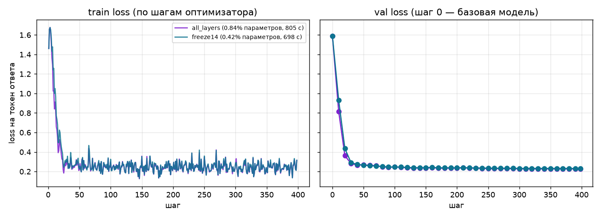

# ДЗ 5 — LoRA на собственном датасете об экзопланетах

Обучены два адаптера Qwen/Qwen3-0.6B: на всех 28 слоях и только на слоях
14–27. Использованы неизменённые тензоры из ДЗ 4: 3178 примеров train
и 397 примеров val. Исходные диалоги подготовлены в ДЗ 3; разбиение
по звёздным системам не допускает попадания одной системы в обе части.

## Результаты

| Показатель | Все слои | Первые 14 заморожены |
|---|---:|---:|
| Базовый val loss | 1.5886 | 1.5886 |
| Конечный val loss | 0.2271 | 0.2310 |
| Шаги оптимизатора | 398 | 398 |
| Обучаемые параметры | 5 046 272 | 2 523 136 |
| Чистое обучение, секунды | 804.7 | 697.7 |

Одна эпоха, seed 42, LoRA rank 8, learning rate `2e-4`, эффективный батч 8.
Обучение выполнено на Apple M5 через MPS, базовые веса — bfloat16.
Val loss измерен до обучения, каждые 10 шагов и на последнем шаге.
Заморозка сократила чистое время обучения на 13.30%, но не снизила
измеренный пик памяти Metal. Подробные числа приведены в отчёте.

- [Кривые train и val для двух вариантов](docs/curves.png).
- [Сравнение базы и адаптера на пяти фиксированных вопросах](docs/compare.md).
- [Пять исправленных дефектов и численные подтверждения](docs/defects.md).



Ограничение: на пяти вопросах о звёздных системах, отсутствующих в train,
ни база, ни адаптер не дали правильных численных значений (0 из 5).
Адаптер освоил краткий формат ответа; снижение teacher-forcing val loss
не означает надёжного знания архивных фактов. Эталонные ответы в отчёте
взяты из val ДЗ 3 и не передавались модели при генерации.

## Воспроизведение

Из каталога `hw5-broken`:

```bash
uv sync --locked
mkdir -p data/tokenized
cp ../hw4-broken/data/tokenized/train.pt data/tokenized/train.pt
cp ../hw4-broken/data/tokenized/val.pt data/tokenized/val.pt
make train        # два полных прогона и docs/curves.png
make compare      # docs/compare.md
make check        # девять проверок, включая два коротких обучения
```

Если тензоров ещё нет, сначала выполните стадию tokenize в ДЗ 4.
Первой загрузке базовой модели нужен доступ к Hugging Face.
Адаптеры, тензоры, метрики и виртуальное окружение исключены из Git;
на новой машине их нужно получить указанными командами. В репозитории
сохранены код, конфигурация, lock-файл, график и отчёты.

Все девять проверок пройдены. `tests/check.sh` не изменялся:
его отпечаток — `06a02208c1f0`. Отпечаток входов полных прогонов —
`6f9f56d101b1`. После изменения обучающего кода или параметров обучения
нужно заново выполнить `make train`, иначе проверка обнаружит устаревшие
артефакты. Изменение только текста отчётов переобучения не требует.

## Исправления

1. Включена оценка val до обучения, во время и после него.
2. Learning rate уменьшен с `1e-2` до `2e-4`.
3. `freeze_first` действительно ограничивает слои установки LoRA.
4. В папку адаптера сохраняются токенизатор, настройки и шаблон чата;
   сравнение загружает токенизатор локально без сети.
5. Seed применяется до создания модели и адаптера.

Также корректно обрабатывается последний неполный блок накопления
градиентов; локальные файлы прогресса показывают состояние обоих прогонов.

## Структура

```text
params.yaml          конфигурация модели, данных, обучения и сравнения
dvc.yaml             стадии train_all, train_freeze, compare
src/runtime.py       устройство, dtype, seed, память
src/data.py          загрузка тензоров из ДЗ 4
src/train.py         обучение, оценка, сохранение адаптера и прогресса
src/compare.py       сравнение базы и адаптера с архивными ответами
src/plot.py          графики train/val
tests/check.sh       неизменённая самопроверка
docs/                итоговый график и отчёты
```

`make clean` удаляет локальные адаптеры, метрики, график и сравнение.
`make distclean` дополнительно удаляет `.venv`; эти команды не нужны
для проверки готовой работы. При нехватке памяти можно изменить
`batch_size` на 1 и `grad_accum` на 8, сохранив эффективный батч.
Для CPU следует выбрать `float32`; `max_steps` ограничивает пробный запуск.
